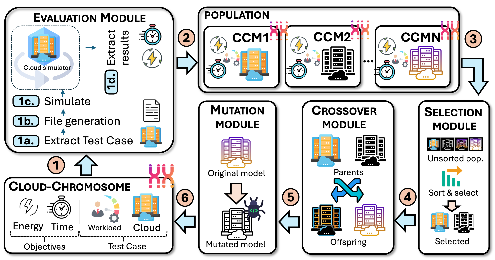
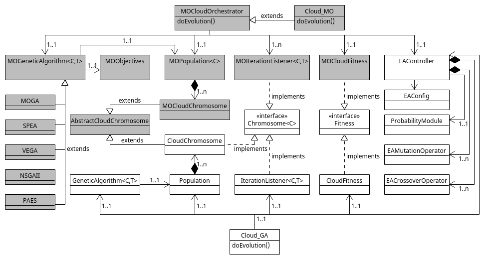

# CloudEvolve – Multi‑Objective Optimization Framework for Cloud Infrastructures


> **CloudEvolve** is a modular framework for evolving cloud architectures through multi‑objective genetic algorithms (MOGAs). It enables the simultaneous optimisation of energy consumption and performance, integrating seamlessly with simulators such as CloudSim.

---

### High‑Level Architecture



### Class Diagram



---

## Supported Algorithms

* VEGA (Vector Evaluated Genetic Algorithm)
* MOGA (Multi‑Objective Genetic Algorithm)
* NSGA‑II (Non‑Dominated Sorting Genetic Algorithm II)
* SPEA2 (Strength Pareto Evolutionary Algorithm 2)
* PAES (Pareto Archived Evolution Strategy)

---

## Project Structure

```
cloudevolve/
├── src/
│   ├── algorithms/        # MOEA implementations
│   ├── configuration/     # Experiment configs (YAML)
│   ├── entities/          # Domain entity definitions
│   ├── main/              # Entry point (CLI / scripts)
│   ├── auxiliars/         # Common utilities & helpers
│   ├── core/              # Orchestration kernel
│   ├── executor/          # Simulator adapters & evaluation runners
│   └── transformations/   # Data transformations & post‑processing
└── docs/                  # Guides and reference material
```

---

## License

Distributed under the **MIT License**. See the `LICENSE` file for details.

---

## Acknowledgements

* CloudSim‑Storage for the underlying simulation engine.
* MOEA algorithms inspired by the work of Deb, Zitzler and Corne.

