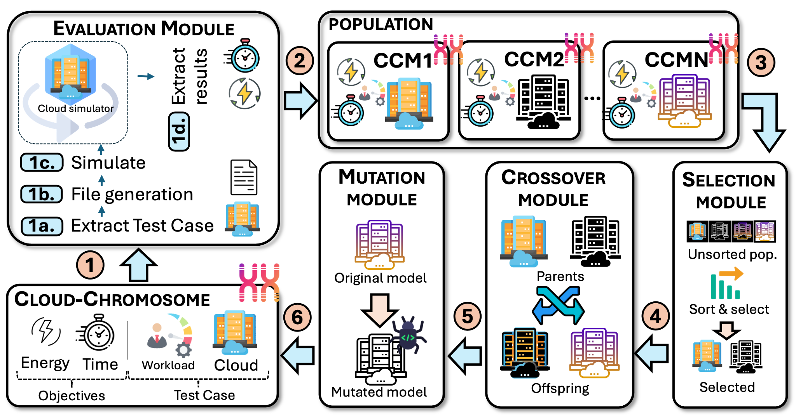
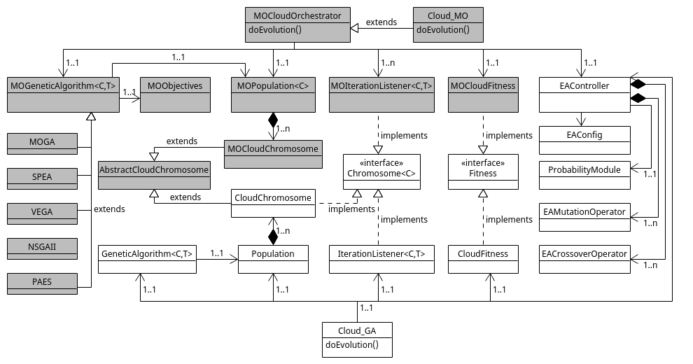

# CloudEvolve – Multi-Objective Optimization Framework for Cloud Infrastructures

**CloudEvolve** is a modular framework for evolving cloud architectures through multi-objective genetic algorithms (MOGAs). It enables the simultaneous optimisation of energy consumption and performance, integrating seamlessly with simulators such as CloudSim.

---

### General Architecture



The optimisation workflow follows six main stages:

- **Cloud-chromosome encoding** – each individual captures a *workload* and its target *cloud model* while tracking the objectives (energy consumption and response time).
- **Candidate model instantiation** – the chromosome is materialised into one or more *Cloud Configuration Models* (CCMs) that realise the logical architecture.
- **Simulation & evaluation** – every CCM is executed in the simulation backend to measure the objective metrics.
- **Selection** – the raw population is Pareto-sorted; the top individuals are chosen as parents.
- **Crossover** – selected parents exchange structural segments of their architectures to create offspring CCMs.
- **Mutation** – random modifications are applied to offspring models, introducing new configurations before they re-enter the evaluation loop.

The loop repeats until a stopping criterion is met, ultimately yielding the Pareto front of energy-/performance-optimal cloud architectures.

### Class Diagram



---

## Requirements

- **JDK 17+** (the build targets Java 17).
- **Maven 3.6+** to build and run the test suite.
- The metamorphic-testing layer (`lib/MT.jar`) is bundled, and JUnit / commons-io
  are resolved by Maven. The CloudSim-Storage simulator backend
  (`repro/cloudsimStorage.jar`) is also bundled for the smoke tests, and is only
  required for actual evolution runs.

---

## Quick Start

Build the project and run the full test suite — **no simulator required**:

```bash
mvn test
```

This runs the unit tests plus in-memory *smoke tests* that drive all nine MOEAs
through the complete selection / crossover / mutation / dominance pipeline. It
needs nothing beyond the JDK and Maven.

### Run against the real simulator (optional)

To additionally exercise the bundled CloudSim-Storage backend end-to-end, opt in:

```bash
mvn test -Dce.runSimulatorTests=true
```

This launches the real simulator on the ready-to-run fixture under `repro/smoke/`
(a downscaled `Al_w3` case): it evolves a small population per algorithm and
checks the resulting energy/time figures are sane.

### Run a full experiment (optional)

The launchers under `src/main_scico/` (`Launcher_VEGA`, `Launcher_MOGA`, …) run a
complete evolution for one algorithm against the simulator. They resolve their
paths from `CLOUDEVOLVE_WORKSPACE` (see [Configuration](#configuration)), so point
it at a directory holding `cloudsimStorage/cloudsimStorage.jar` and a
`cloudsimStorage/evolutionary/InitialPopulation/<case>` tree, then run e.g.
`main_scico.Launcher_VEGA`.

### Run with the surrogate model (fast, no simulator)

A third backend, `eSURROGATE`, replaces the CloudSim-Storage simulator with a
trained **LightGBM** surrogate that predicts `(energy, time)` directly from the
cloud configuration. Everything else — algorithms, metamorphic testing, cloud
topology, the test-case I/O format — is identical, so it is a drop-in evaluator
that turns minutes-per-candidate simulations into microseconds.

The models live in [`lib/surrogate/`](lib/surrogate) (two `*_lgbm.txt` files in
LightGBM's native text format) and are read by a small, dependency-free
evaluator ([`platform.surrogate.LightGbmModel`](src/platform/surrogate/LightGbmModel.java));
a [golden-master test](src/platform/surrogate/SurrogateModelGoldenTest.java) pins
the Java predictions to the original Python models bit-for-bit. Select it by
passing `eSURROGATE` as the backend and the model directory in place of the
simulator jar. The ready-to-run wrapper is
[`repro/launcherSurrogate.sh`](repro/launcherSurrogate.sh):

```bash
cd repro
./launcherSurrogate.sh -a eNSGAII -n Al_w3 -i 100
```

To see how good (and how fast) the surrogate is versus the real simulator, run
the comparison tool ([`main.java.SurrogateComparison`](src/main/java/SurrogateComparison.java)).
It prints a per-evaluation accuracy table (surrogate vs the recorded simulator
output for every bundled config), the surrogate's throughput, and a live
wall-clock head-to-head:

```bash
repro/compareSurrogate.sh          # add --no-sim to skip the live simulator run
```

With `--evolve` it additionally runs the **same short evolution twice** (real
simulator vs surrogate), then plots the best-so-far **energy** and **time** per
generation into two comparison graphs under `repro/out_compare/`:

```bash
repro/compareSurrogate.sh --evolve -a eNSGAII -n Al_w1 -i 6   # needs gnuplot
```

### Hybrid backend + re-training loop

A fourth backend, `eHYBRID` ([`platform.HybridPlatform`](src/platform/HybridPlatform.java)),
combines both: it evaluates with the surrogate but routes evaluations to the
**real simulator every N generations**, so the accurate values flow back into
NSGA-II's selection (self-correction) and are logged to `surrogate_increment.csv`.
The real backend is injectable (`-Dcloudevolve.hybrid.real`, default
CloudSim-Storage), so the hybrid composes with any simulator.

```bash
repro/launcherHybrid.sh -a eNSGAII -n Al_w1 -i 20 -e 5   # real simulator every 5 generations
```

Because the hybrid spends its real budget where the search converges (the region
the surrogate is weakest), the increment accumulates the **hard examples** —
active learning by construction. Feed them back into the model with:

```bash
python repro/retrain_surrogate.py --dataset <surrogate_dataset.parquet> \
       --increment repro/surrogate_increment.csv --out lib/surrogate --emphasize 3.0
```

which merges the originals with the increment (up-weighting the worst-predicted
rows) and re-exports the LightGBM `.txt` models in place.

Two non-invasive safeguards make this robust against the optimiser exploiting the
surrogate's errors (it will find any blind spot — e.g. a phantom near-zero-energy
config):

- **Plausibility guard** (`-Dcloudevolve.surrogate.guard=none|nonneg|clamp`,
  default `nonneg`): clips predictions to ≥0 or to the training target range, so
  impossible/extrapolated values can't become fake optima.
- **Offline adversarial loop** ([`repro/adversarial_loop.sh`](repro/adversarial_loop.sh)):
  evolve with the surrogate → **audit the final front with the real simulator**
  ([`main.java.AuditFront`](src/main/java/AuditFront.java), which corrects the
  reported front and harvests the exploited configs) → retrain → repeat. The GA
  generates the hard examples, the simulator labels them, the model learns them —
  all without touching the GA engine.

```bash
repro/adversarial_loop.sh -d <surrogate_dataset.parquet> -a eNSGAII -n Al_w1 -i 8 -k 3
```

---

## Configuration

The simulator and its data (jar, evolutionary runs, initial populations) are
resolved from a single configurable **workspace root**, so you never have to edit
source:

| Source | Key | Default |
|---|---|---|
| Environment variable | `CLOUDEVOLVE_WORKSPACE` | `/localSpace/cloudEnergy` |
| JVM system property | `-Dcloudevolve.workspace` | (overrides the env var) |

Each simulator appends its own subtree. For example, with
`CLOUDEVOLVE_WORKSPACE=/Users/you/cloudEvolution`, CloudSim-Storage runs live
under `/Users/you/cloudEvolution/cloudsimStorage/evolutionary`:

```bash
export CLOUDEVOLVE_WORKSPACE=/Users/you/cloudEvolution
```

> The previous names `CLOUDEVOLVE_HOME` / `-Dcloudevolve.home` are **deprecated**
> but still honoured as a fallback.

---

## Supported Algorithms

* **MOGA** — Multi-Objective Genetic Algorithm
* **VEGA / VEGA2** — Vector Evaluated Genetic Algorithm
* **NSGA-II / NSGA-II2** — Non-Dominated Sorting Genetic Algorithm II
* **SPEA2 / SPEA3** — Strength Pareto Evolutionary Algorithm
* **PAES / PAES2** — Pareto Archived Evolution Strategy

---

## Project Structure

```
cloudevolve/
├── src/
│   ├── algorithms/        # MOEA implementations (MOGA, VEGA, NSGA-II, SPEA2, PAES, …)
│   ├── configuration/     # Experiment configuration, mutation/crossover operators
│   ├── core/              # Orchestration kernel (evolution loop, fitness)
│   ├── entities/          # Cloud-chromosome domain model
│   ├── executor/          # Simulator adapters & evaluation runners
│   ├── platform/          # Per-simulator strategy (paths, operators, execution, transforms)
│   │   └── surrogate/     # Pure-Java LightGBM evaluator for the eSURROGATE backend
│   ├── transformations/   # Test-case <-> cloud-model transformations
│   ├── main/              # CLI entry points
│   ├── main_scico/        # Experiment launchers (Launcher_VEGA, …)
│   └── auxiliars/         # Common utilities & helpers
├── lib/MT.jar             # Bundled metamorphic-testing layer
├── lib/surrogate/         # Trained LightGBM surrogate models (eSURROGATE backend)
├── repro/                 # Bundled simulator jar + ready-to-run smoke fixtures
└── docs/                  # Guides and reference material
```

---

## License

Distributed under the **GNU General Public License v3.0**. See the `LICENSE`
file for the full text.

Some files under `src/algorithms/` are derived from Yuriy Lagodiuk's genetic
algorithm library and retain their original Apache License 2.0 headers, which is
compatible with GPLv3.

---

## Acknowledgements

* CloudSim-Storage for the underlying simulation engine.
* MOEA algorithms inspired by the work of Deb, Zitzler and Corne.
